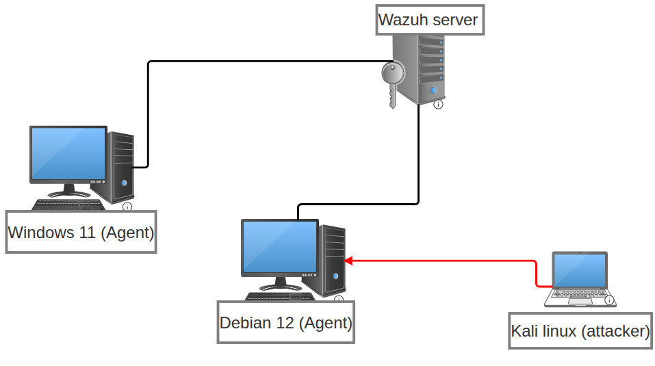
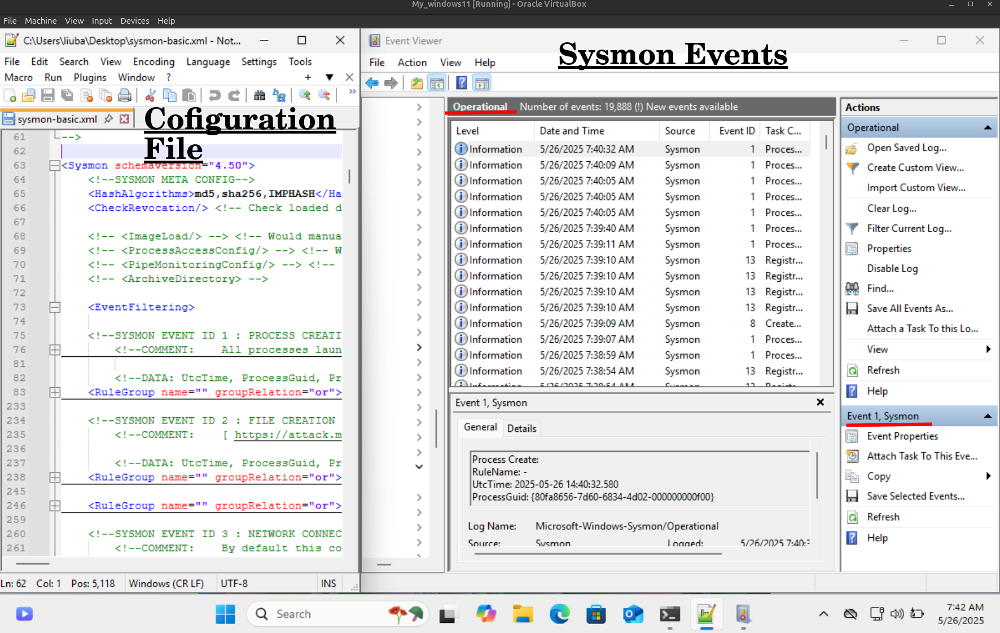
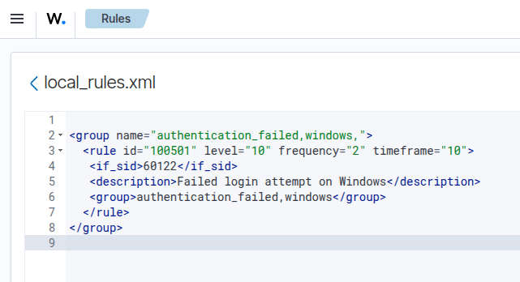
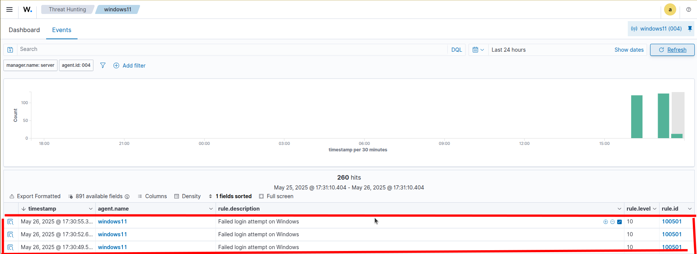
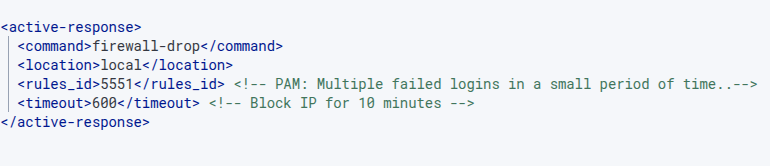
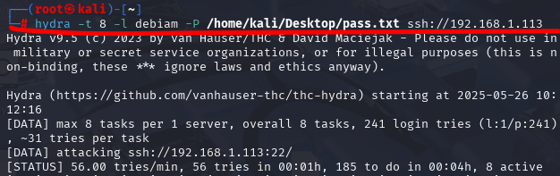
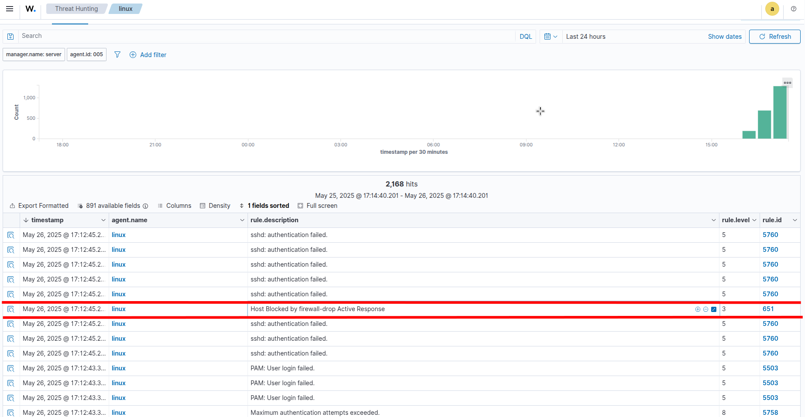
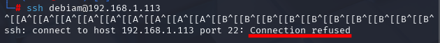

# Wazuh SIEM Home Lab – Detection and Prevention of Suspicious Activities

This project documents the setup and demonstration of a **Wazuh SIEM system in a home lab environment**. The primary focus is on configuring the SIEM to detect and respond to various suspicious activities, including brute-force attacks and malicious script execution.

## Project Overview
The goal of this home lab is to establish a **practical and functional Wazuh SIEM environment**. This setup provides a platform for learning and experimenting with threat detection, log analysis, alerting mechanisms, and automated incident response procedures in a controlled setting.

## 🔍 Project Goals

- Set up a fully functional Wazuh SIEM system  
- Monitor both Windows and Linux endpoints  
- Use Sysmon for advanced telemetry on Windows  
- Create and test custom detection rules  
- Simulate real-world attacks and detect them  
- **Implement automated prevention using Wazuh Active Response**
📷 **Lab Diagrame** 
 

## 🧪 Tools and Technologies

| Component        | Role                        |
|------------------|-----------------------------|
| Wazuh Server     | Log aggregation + analysis  |
| Windows 11       | Endpoint with agent + Sysmon |
| Debian 12        | SSH target with agent       |
| Kali Linux       | Attacker                    |
| Hydra            | Brute-force tool            |

## 🧩 Key Steps

### 1. Wazuh Server Setup  
- Ubuntu 22.04, installed via [official installation script](https://documentation.wazuh.com/current/quickstart.html#quickstart)
- Enabled web dashboard + Wazuh manager

📷 **Wazuh Server Dashboard**  

---

### 2. Agents Deployment
- Installed Wazuh agent on Windows + Sysmon
- Installed Wazuh agent on Linux

📷 **Sysmon on Windows**  

📷 **Connected Agents in Wazuh Dashboard**  

---

### 3. Malicious PowerShell Script Execution  
- Executed a simulated malicious PowerShell script on the Windows endpoint  
- Sysmon captured the activity, and Wazuh flagged it as suspicious using [**MITRE ATT&CK mappings**](https://attack.mitre.org/)

📷 **Alert for Malicious Script Execution**  

  #### 🧠 Summary of Techniques Used:
   | MITRE ID                                                    | Name                                          |
   |-------------------------------------------------------------|-----------------------------------------------|
   | [T1105](https://attack.mitre.org/techniques/T1105/)         | Ingress Tool Transfer                         |
   | [T1059.001](https://attack.mitre.org/techniques/T1059/001/) | Command and Scripting Interpreter: PowerShell |
   | [T1070.004](https://attack.mitre.org/techniques/T1070/004/) | Indicator Removal: File Deletion              |
  
    ✅ These alerts demonstrate how Wazuh, enhanced with Sysmon, can detect behaviors commonly associated with malware infections and post-exploitation activity.

---

### 4. Custom Rule
- Created a custom rule to detect multiple failed logon attempts in Windows (2 failures within 10 seconds)
- Tested the rule using Windows Event Logs sent via the agent

📷 **Custom Wazuh Rule**  

📷 **Generated Alert for Failed Logon Attempts**  

✅ This rule is useful for detecting brute-force or password-guessing attempts on Windows machines.

---

### 5. Brute-Force Attack Simulation (Hydra)  
- Used **Hydra** on Kali Linux to simulate an SSH brute-force attack on the Debian server  
- Wazuh detected the attack via custom rules and triggered **active response**
- Active Response was configured to block the attacker’s IP using the [firewall-drop](https://documentation.wazuh.com/current/user-manual/capabilities/active-response/ar-use-cases/blocking-ssh-brute-force.html) script

📷 **Active Response Rule**  

📷 **Hydra Command Running**  

📷 **Alert in Wazuh + SSH Block Confirmation**  
  

✅ This demonstrates **not just detection, but automated prevention** — the attacker was identified and their IP was blocked in real-time using Wazuh's built-in response mechanism.

---

## ✅ What I Learned

- How to install and configure Wazuh as a SIEM platform  
- Using Sysmon for detailed and high-fidelity telemetry on Windows  
- Creating, testing, and tuning custom detection rules in Wazuh  
- Simulating realistic attack scenarios for detection testing  
- Understanding basic alert triage and incident analysis  
- Implementing **automated threat response (prevention)** using Wazuh Active Response

---

