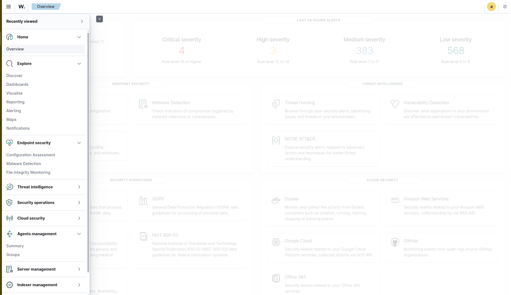
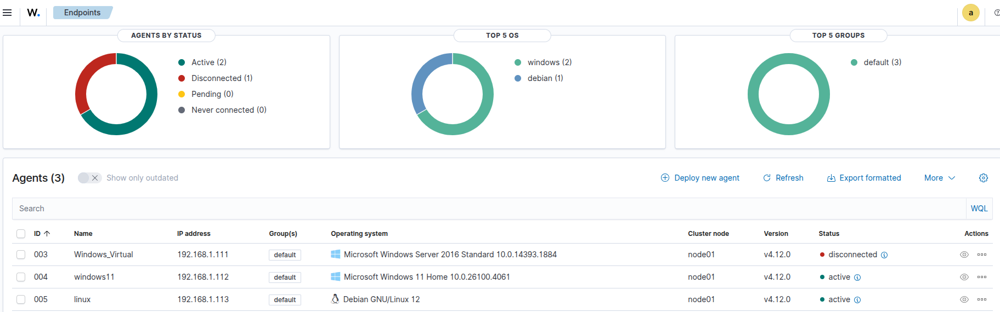
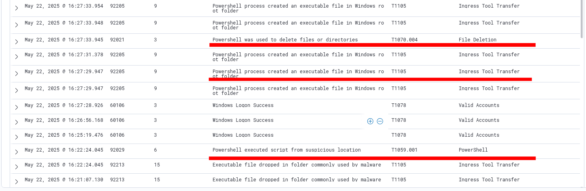

# Wazuh SIEM Home Lab – Detection of Suspicious Activities
This project documents the setup and demonstration of a Wazuh SIEM system in a home lab environment. The primary focus is on configuring the SIEM to detect various suspicious activities, including brute-force attacks and the execution of malicious scripts

## Project Overview
The main objective of this home lab is to establish a practical and functional Wazuh SIEM environment. This setup serves as a platform for learning and experimenting with threat detection, log analysis, alert mechanisms, and incident response procedures in a controlled setting.

## 🔍 Project Goals

- Set up a working Wazuh SIEM system
- Monitor Windows & Linux endpoints
- Create and test custom detection rules
- Simulate real-world attacks
- Practice alert analysis and incident handling

 

## 🧪 Tools and Technologies

| Component        | Role                        |
|------------------|-----------------------------|
| Wazuh Server     | Log aggregation + analysis  |
| Windows 11       | Endpoint with agent + Sysmon |
| Debian 12        | SSH target with agent       |
| Kali Linux       | Attacker                    |
| Hydra            | Brute-force tool            |

## 🧩 Key Steps

### 1. Wazuh Server Setup  
- Ubuntu 22.04, installed via official script  (https://documentation.wazuh.com/current/quickstart.html#quickstart)
- Enabled web dashboard + Wazuh manager
#### Dashboard:
  📷 

---

### 2. Agents Deployment
- Installed Wazuh agent on Windows + Sysmon
- Installed and configured Sysmon (SwiftOnSecurity config)
- Installed Linux agent
📷 
📷 

---

### 3. Malicious PowerShell Script Execution  
- Ran test malicious script on Windows  
- Sysmon captured event, Wazuh flagged it as suspicious  using MITRE ATT&CK classifications.

  Alerts: 

  #### 🧠 Summary of Techniques Used:
   | MITRE ID       | Name                                          |
   |----------------|-----------------------------------------------|
   | T1105          | Ingress Tool Transfer                         |
   | T1059.001      | Command and Scripting Interpreter: PowerShell |
   | T1070.004      | Indicator Removal: File Deletion              |
     ##### These alerts demonstrate how Wazuh, with the help of Sysmon, can detect key behaviors associated with malware infections and post-exploitation scripts

---

### 4. Custom Rules
- Wazuh rules created to detect failed SSH login attempts
- Tested against logs forwarded from Windows

📷 

---

### 5. Brute-Force Attack Simulation (Hydra)  
- Kali used to run brute-force against Ubuntu via SSH  
- Alerts generated, matched against custom rule  
📷 

---

## ✅ What I Learned

- How to set up and configure Wazuh as a SIEM
- How to use Sysmon for detailed Windows telemetry
- Writing and tuning custom rules in Wazuh
- Simulating real threats to test detection
- Basics of incident analysis from alerts

